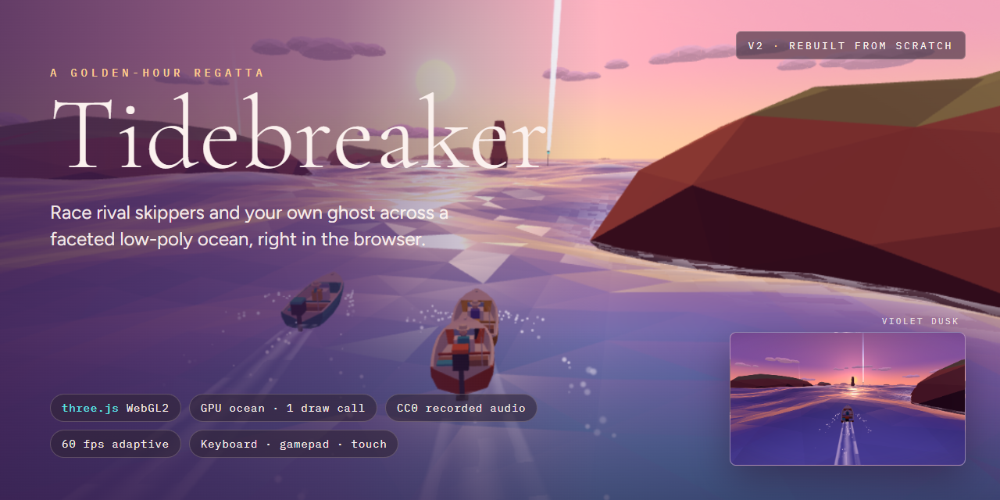
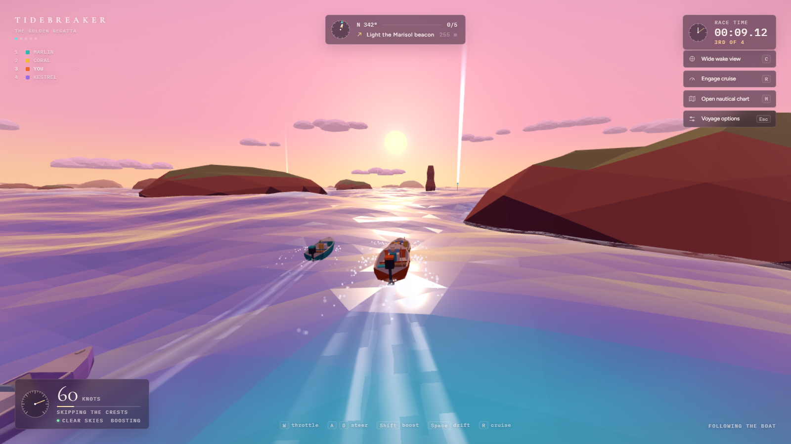
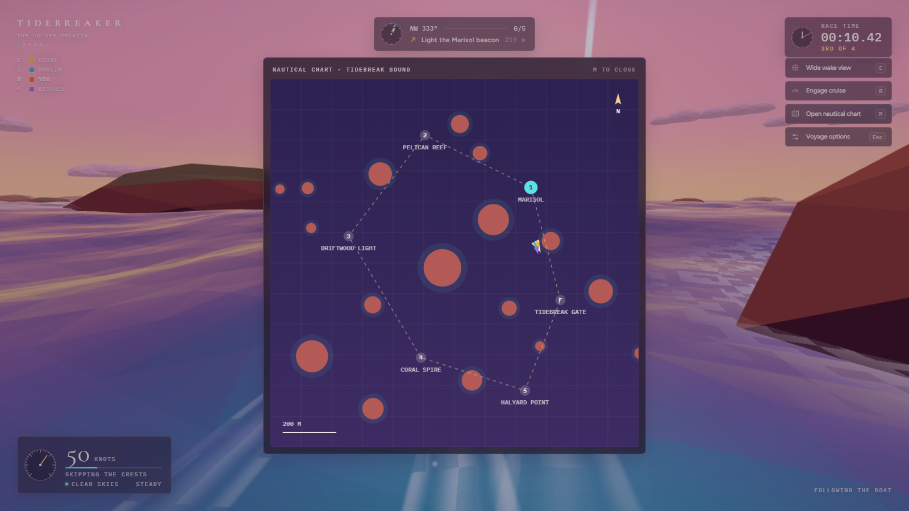
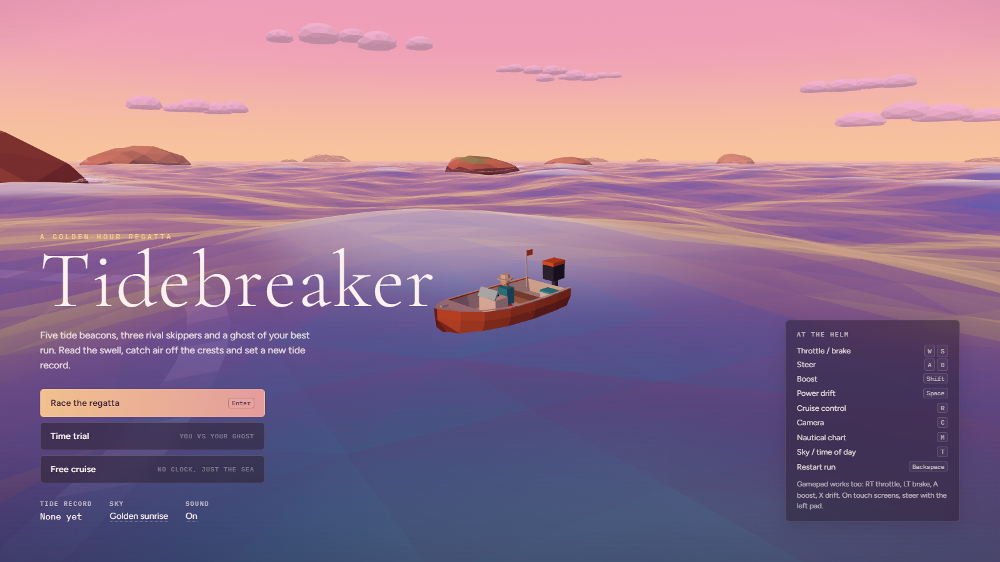
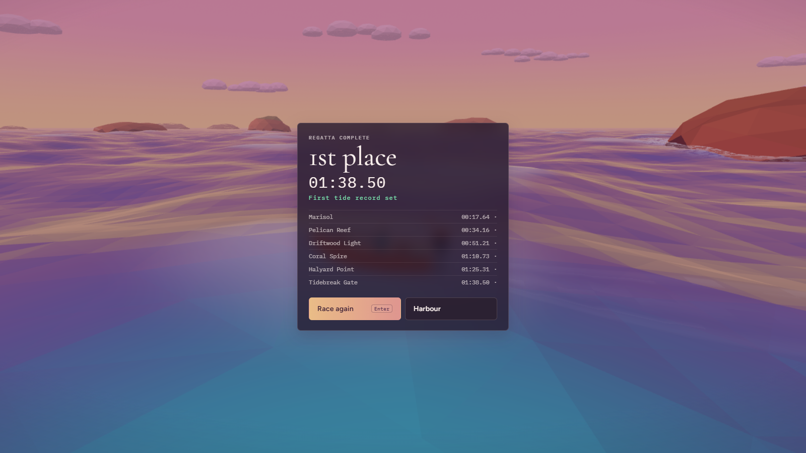

<p align="center">
  
</p>

<p align="center">
  <a href="https://hammadshakeelai.github.io/Tidebreaker/"><b>▶ Play in your browser</b></a> ·
  <a href="#how-to-play">How to play</a> ·
  <a href="#under-the-hood">Under the hood</a> ·
  <a href="https://github.com/hammadshakeelai/Boat-Chase">Previous version: Boat Chase</a>
</p>

<p align="center">
  
  
  
  
  
</p>

# Tidebreaker

A fast boat-racing game set on a pastel, golden-hour ocean. You drive a small orange skiff over a faceted low-poly sea, catch air off wave crests, power-drift around sea stacks and light five tide beacons before three rival skippers do. Each run is recorded, so on your next race you're also up against a ghost of your best time.

It runs in the browser and loads in a second or two. There are no model files: every mesh, shader and wave is generated in code.

| Racing the regatta | Nautical chart |
| :---: | :---: |
|  |  |
| **Harbour menu** | **Results and splits** |
|  |  |

## How to play

Light the beacons in order, **Marisol → Pelican Reef → Driftwood Light → Coral Spire → Halyard Point**, then cross the **Tidebreak Gate**.

| Action | Keyboard | Gamepad |
| :--- | :--- | :--- |
| Throttle / brake & reverse | `W` / `S` | RT / LT |
| Steer | `A` / `D` | Left stick |
| Boost | `Shift` | A or RB |
| Power drift | `Space` | X or LB |
| Cruise control | `R` | B |
| Camera: chase / wide / helm | `C` | Y |
| Nautical chart | `M` | View |
| Sky: sunrise / noon / dusk | `T` | D-pad up |
| Pause & options | `Esc` | Start |
| Restart run | `Backspace` | |

On touch screens you get a steering pad and throttle, brake, boost and drift buttons.

**Racing tips**
- Your boost meter refills when you light a beacon, when you land a big jump, and while you hold a drift through a corner.
- Swells travel across the course. Hit the front of a crest at speed and you'll fly.
- The split shown at each beacon is compared against your record run: green means you're ahead.

### Modes
- **Regatta**: you against Marlin, Coral and Kestrel, plus your ghost.
- **Time trial**: just you and the ghost of your best run.
- **Free cruise**: no clock. The beacons relight each time you finish a circuit.

## Under the hood

**Rendering (three.js)**
- **One-draw-call ocean.** A grid that's uniform near the camera (snapped, so facets never crawl) and stretches out to the horizon. Waves are displaced in the vertex shader, and flat shading comes from screen-space derivatives.
- **Shared wave model.** The same sum of sharpened directional swells runs in GLSL and in JavaScript, so the physics samples exactly the surface you see.
- **Water shading.** Turquoise when you look down into it, indigo at grazing angles, sky reflection at the horizon, a sun glint path, and glitter on individual facets.
- **Scenery.** Sky dome with sun disc and dithered gradient, flat-bottomed low-poly clouds, and distant island silhouettes. Everything else is merged into a handful of draw calls.
- **Wake and spray.** Wake ribbons are laid on the live wave surface. Spray is a single pooled `Points` cloud shared by every boat.
- **No shadow maps and no post-processing.** A CSS vignette and speed-lines give the feel for free.

**Performance**
- Fixed 120 Hz physics with render interpolation, so handling feels the same at 30, 60 or 144 fps.
- Adaptive resolution: pixel ratio drops when frames run long and climbs back when there's headroom. If that isn't enough, the ocean switches to a lighter grid. You can pin **High** or **Low** in the options.
- The HUD only touches the DOM when a value changes. Nothing in the hot loops allocates.
- The production bundle is about 84 KB of game code plus three.js (121 KB gzipped). Each browser downloads about 580 KB of audio, in Ogg or AAC depending on what it supports.

**Handling**
- Arcade planing-hull physics with a buoyancy spring, gravity, lateral grip, drift slip, and speed-sensitive steering.
- Pitch and roll follow the sampled wave surface. The engine revs up when the prop leaves the water.
- Keyboard input is eased like a real wheel and throttle. Gamepad triggers and sticks are fully analog.

**Audio (Web Audio API, real recorded CC0 samples)**
- The outboard is three RPM layers crossfaded and pitched by load and throttle, through a lowpass that opens as you open the throttle.
- Hull water rush, spray hiss and wind all follow your speed. Distant waves wash past in stereo, and there's a panned engine for the nearest rival.
- Splashes scale with landing impact. Beacon bells rise in pitch as you progress.
- [`tools/audio/build-audio.mjs`](tools/audio/build-audio.mjs) rebuilds every sound from its source URL. It crossfades loops so they're seamless (it measures the seam before and after), normalizes levels and encodes Ogg + AAC.

## Run it locally

```bash
npm install
npm run dev
```

Open <http://127.0.0.1:5173>. To make a production build:

```bash
npm run build
npm run preview
```

To rebuild the audio from the original CC0 sources (needs `ffmpeg`):

```bash
npm run audio
```

Every push to `main` builds the game and deploys it to GitHub Pages ([`.github/workflows/deploy.yml`](.github/workflows/deploy.yml)).

## Project layout

```
src/
  main.js      renderer, game loop, state machine, adaptive quality
  waves.js     shared wave model (GLSL + JS)
  ocean.js     faceted ocean mesh and shader
  sky.js       sky dome, clouds, horizon silhouettes
  palette.js   time-of-day palettes with cross-fades
  world.js     course, islands, surf, beacons, AI racing lines
  boat.js      procedural skiff model + planing physics
  wake.js      wake ribbons and pooled spray
  race.js      countdown, checkpoints, AI skippers, splits, ghost
  camera.js    chase / wide / helm / orbit camera rig
  input.js     keyboard, gamepad and touch
  audio.js     Web Audio mixer
  hud.js       instrument-style HUD
  chart.js     nautical chart overlay
tools/audio/   reproducible CC0 audio pipeline
```

## Credits

three.js, Vite and Fontsource, plus CC0 sounds from Kenney, rubberduck, Benjamin Burnes, domasx2 and jasinski. The full list with links is in [CREDITS.md](CREDITS.md).

Tidebreaker is the rebuilt successor to **[Boat Chase](https://github.com/hammadshakeelai/Boat-Chase)**.

## License

Code is MIT. Audio is CC0. Fonts are OFL. See [LICENSE](LICENSE) and [CREDITS.md](CREDITS.md).
